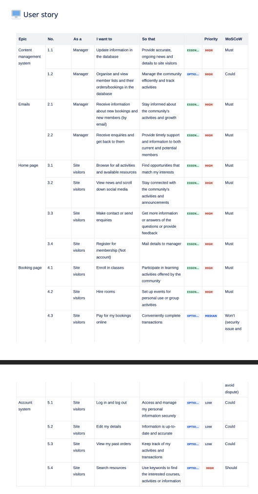
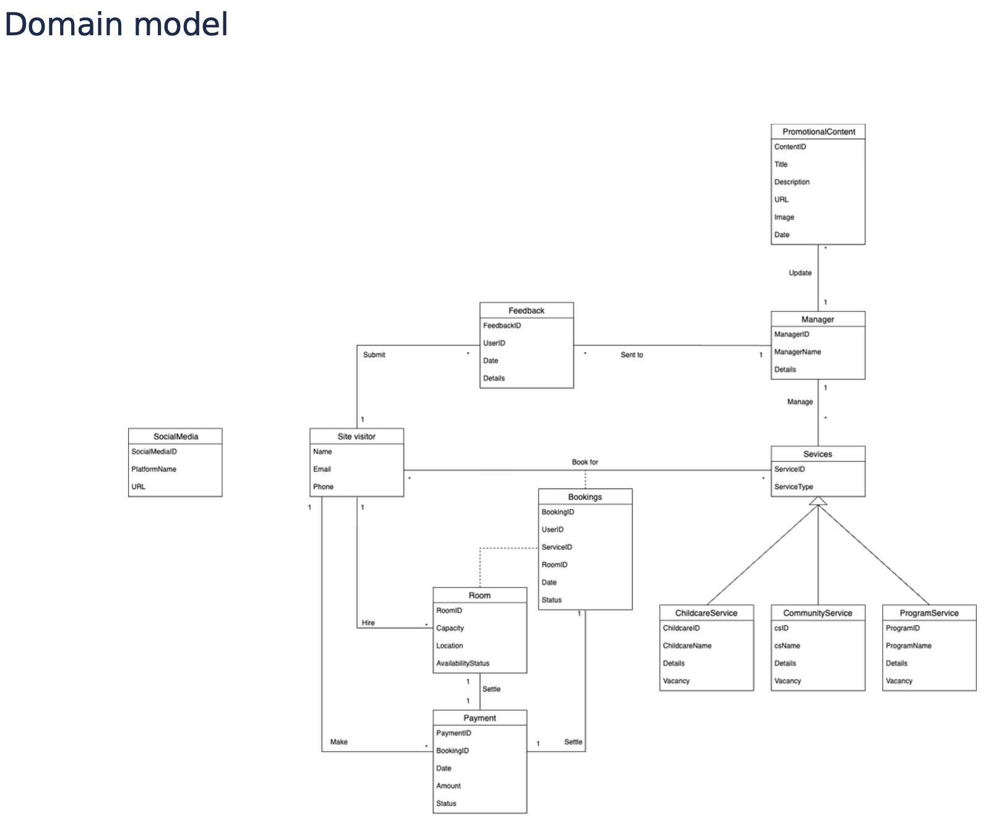
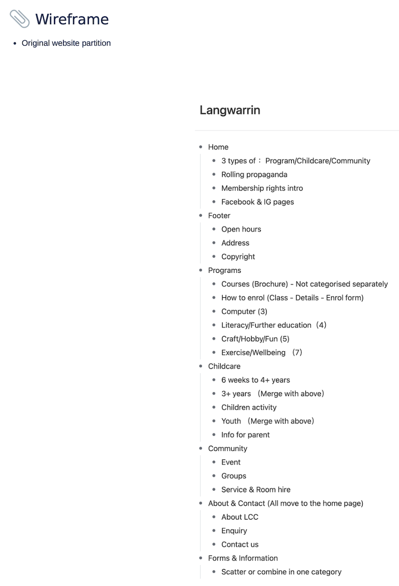
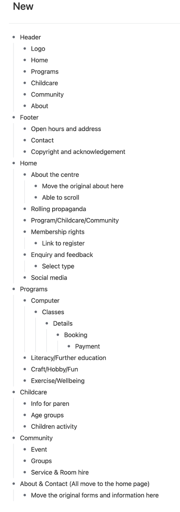
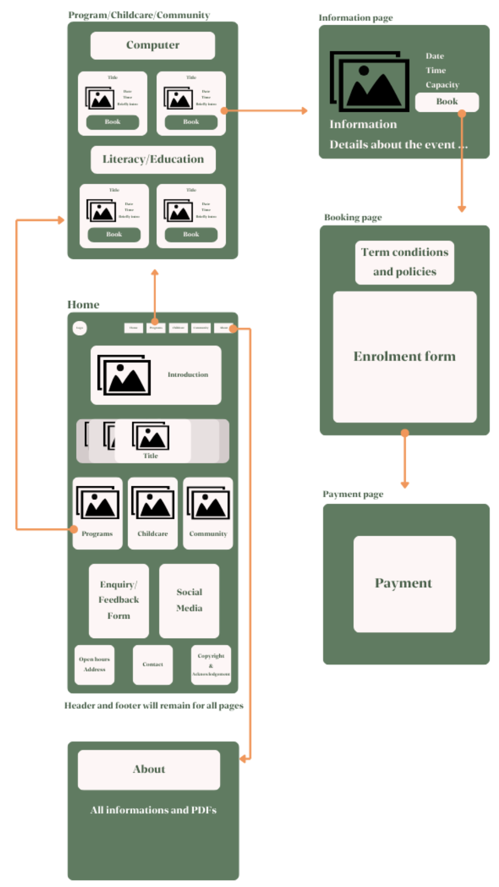

# Website for Langwarrin Community Centre

This project aims to modify and enhance the Langwarrin Community Centre website to provide a more modern and user-friendly experience. The new website will retain all existing information and features while adding the following enhancements and improvements:
1. Content Preservation: All information currently available on the existing website will be retained to ensure users continue to access the content they need.
2. Variety of Offerings: The site will showcase different types of classes, activities, and room hire options to attract a broader range of participants.  
3. Content Management: A user-friendly content management system will be implemented, allowing administrators to update the website content with little or no coding required.  
4. Bookings Management: The manager will be able to view and receive users' booking information, facilitating the management of various booking requests.  
5. Enrollment System: A new enrollment form will replace the existing booking system, enabling users to book classes and hire rooms online.  
6. Social Media Integration: Links to social media platforms will be included, allowing users to stay connected with the community center.  
7. Scrolling Promotional Page: A scrolling promotional page will be added, inspired by other successful websites, to enhance the user experience.  
8. Feedback and Contact: A user feedback form and online support options will be provided to help users resolve issues or provide suggestions.  
9. Payment Method: Users will be able to pay their fees online, simplifying the payment process.  

## Tech Stack
- Frontend: HTML, CSS, JavaScript
- Backend: Node.js, JavaScript
- Database: MongoDB
- Deployment: Google Cloud Platform (APP ENGINE)
- Testing: Postman

## Accessing the Website
1. Open your web browser and navigate to https://www.langwarrincc.org.au/.
2. You will be directed to the homepage, where you can see an overview of the community center’s offerings.

## My Contributions
### 1. Backend Development
    - API Setup: Designed and implemented RESTful APIs to support the project functionality.
    - Database Integration: Set up the MongoDB database, established connections, and populated it with data.
    - API Testing: Verified API functionality and reliability using Postman.
    - Security Measures: Ensured sensitive systems, such as the admin panel, are secured and inaccessible to unauthorized users.
### 2. Deployment
    - Deployed the website on Google Cloud Platform (GCP), ensuring smooth operation and scalability.
### 3. Frontend Contribution
    - Collaborated with the frontend team to develop a single-page HTML layout for displaying activities, adhering to the design specifications.
### 4. Image Storage
    - Configured Google Cloud Storage buckets to store and manage images efficiently.
### 5. Scrum Master Responsibilities
    - Led the sprint planning process and facilitated agile methodologies to ensure efficient progress.
    - Acted as the main communication bridge with the client, ensuring requirements were understood and met.
    - Housekeeping and Coordination
### 6. Design Stage
    - Created user stories, a domain model, and wireframes to align the development with client needs.

